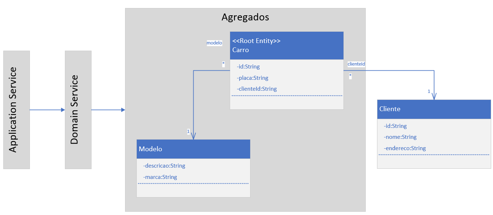

# tapr-2023-equipe1-carro-java


- [Diagrama](diagramas/tapr-microsservico2023.vsdx)

## Autenticação no AZURE
[DOC](https://learn.microsoft.com/en-us/cli/azure/install-azure-cli-linux?pivots=apt)

```
az login -u walter.s@univille.br
az login --use-device-code
az ad signed-in-user show
```

## Extensões do VSCode
[Java Extension Pack](https://marketplace.visualstudio.com/items?itemName=vscjava.vscode-java-pack)
[Springboot Extension Pack](https://marketplace.visualstudio.com/items?itemName=vmware.vscode-boot-dev-pack)
[Rest Client](https://marketplace.visualstudio.com/items?itemName=humao.rest-client)

## Dependências do projeto (pom.xml)
```
        <dependency>
			<groupId>org.springframework.boot</groupId>
			<artifactId>spring-boot-starter-web</artifactId>
		</dependency>

		<dependency>
			<groupId>org.springframework.boot</groupId>
			<artifactId>spring-boot-starter-test</artifactId>
			<scope>test</scope>
		</dependency>

		<dependency>
			<groupId>org.springframework.boot</groupId>
			<artifactId>spring-boot-devtools</artifactId>
			<scope>runtime</scope>
		</dependency>
		<dependency>
			<groupId>com.azure.spring</groupId>
			<artifactId>spring-cloud-azure-starter-data-cosmos</artifactId>
			<version>5.5.0</version>
		</dependency>

		<dependency>
			<groupId>com.azure</groupId>
			<artifactId>azure-spring-data-cosmos</artifactId>
			<version>5.5.0</version>
		</dependency>

		<dependency>
			<groupId>com.azure</groupId>
			<artifactId>azure-identity</artifactId>
			<version>1.10.0</version>
		</dependency>

		<dependency>
			<groupId>org.springdoc</groupId>
			<artifactId>springdoc-openapi-starter-webmvc-ui</artifactId>
			<version>2.1.0</version>
		</dependency>
```

## CosmosDB
- [Introdução](https://learn.microsoft.com/en-us/azure/cosmos-db/introduction)
- [Databases, containers, and items](https://learn.microsoft.com/en-us/azure/cosmos-db/resource-model)

### Configuração RBAC de permissão
```
az cosmosdb sql role assignment create --account-name COSMOSDBACCOUNT --resource-group GRUPODERECURSO --role-assignment-id 00000000-0000-0000-0000-000000000002 --role-definition-name "Cosmos DB Built-in Data Contributor" --scope "/" --principal-id GUIDUSUARIOAD
```

### Falha de conexão com o CosmosDB devido bloqueio na rede da UNIVILLE
- Alunos que utilizarem seus notebooks pessoais conectados a rede UNIVILLE devem alterar o arquivo application.properties para modificar o método de conexão da aplicação com o CosmosDB
- [CosmosDB Gateway Connection](https://learn.microsoft.com/en-us/azure/cosmos-db/dedicated-gateway)
```
spring.cloud.azure.cosmos.connection-mode=gateway
```

### Erro CORS
- [O que é o erro de CORS](https://pt.wikipedia.org/wiki/Cross-origin_resource_sharing#:~:text=Cross-origin%20resource%20sharing%20%E2%80%93%20Wikip%C3%A9dia%2C%20a%20enciclop%C3%A9dia%20livre,pertence%20o%20recurso%20que%20ser%C3%A1%20recuperado.%20%5B%201%5D)

#### Solução
- Criaruma pasta config
- Criar a classe WebConfig.java
```
package br.edu.univille.microservcarro.config;

import org.springframework.context.annotation.Configuration;
import org.springframework.web.servlet.config.annotation.CorsRegistry;
import org.springframework.web.servlet.config.annotation.EnableWebMvc;
import org.springframework.web.servlet.config.annotation.WebMvcConfigurer;

@Configuration
@EnableWebMvc
public class WebConfig implements WebMvcConfigurer  {

    @Override
    public void addCorsMappings(CorsRegistry registry) {
        registry.addMapping("/**");

    }
}
```


## CRUD API REST
### Verbo GET
- Objetivo: Retornar uma lista de objetos ou um objeto específico a partir da chave
#### CarroService.java
- Criar os métodos na interface do serviço
```
public interface CarroService {
    public List<Carro> getAll();
    public Carro getById(String id);
}
```
#### CarroServiceImpl.java
- Implementar a lógica de consulta na classe concreta do serviço
```
@Service
public class CarroServiceImpl implements CarroService{

    @Autowired
    private CarroRepository repository;

    @Override
    public List<Carro> getAll() {
        var iterador = repository.findAll();
        List<Carro> listaCarros = new ArrayList<>();

        iterador.forEach(listaCarros::add);

        return listaCarros;
    }

    @Override
    public Carro getById(String id) {
        var carro = repository.findById(id);
        if(carro.isPresent())
            return carro.get();
        return null;
    }
}
```
#### CarroAPIController.java
- Implememntar no controlador os métodos para buscar do banco todos os carros e para buscar um único carro pelo ID 
```
@RestController
@RequestMapping("/api/v1/carros")
public class CarroAPIController {

    @Autowired
    private CarroService service;

    @GetMapping
    public ResponseEntity<List<Carro>> listaCarros(){
        var listaCarros = service.getAll();
        return 
            new ResponseEntity<List<Carro>>
            (listaCarros, HttpStatus.OK);
    }
    @GetMapping("/{id}")
    public ResponseEntity<Carro> buscarCarro(@PathParam("id") String id){
        var carro = service.getById(id);
        if(carro == null){
            return new ResponseEntity<>(HttpStatus.NOT_FOUND);
        }
        return 
            new ResponseEntity<Carro>
            (carro, HttpStatus.OK);
    }
}
```
#### teste.rest
- Implementação do teste do verbo GET
```
### Buscar todos os carros
GET http://localhost:8080/api/v1/carros

### Buscar carro pelo ID
GET http://localhost:8080/api/v1/carros/580c1134-0409-46e9-99a5-887b8e90636f
```

### Verbo POST
- Objetivo: Inserir uma nova instância da entidade no banco de dados

#### CarroService.java
- Criar o método saveNew na interface de serviço
```
public interface CarroService {
    public List<Carro> getAll();
    public Carro getById(String id);
    public Carro saveNew(Carro carro);
}
```
#### CarroServiceImpl.java
- Implementar a lógica para salvar a nova entidade no banco, o campo ID é alterado para null para garantir que o método será utilizado apenas para incluir novos registros
```
@Override
public Carro saveNew(Carro carro) {
	carro.setId(null);
	return repository.save(carro);
}
```
#### CarroAPIController.java
- Implememntar no controlador o metodo para inserir o novo carro no sistema.
**IMPORTANTE há duas classes RequestBody em pacotes diferentes, utilizar o pacote correto**
```
import org.springframework.web.bind.annotation.RequestBody;
//...
@PostMapping
    public ResponseEntity<Carro> inserirCarro(@RequestBody Carro carro){
        if(carro == null){
            return new ResponseEntity<>(HttpStatus.BAD_REQUEST);
        }
        carro = service.saveNew(carro);
        return 
            new ResponseEntity<Carro>
            (carro, HttpStatus.OK);
    }
```

#### teste.rest
- Implementação do teste do verbo POST
```
### Inserir um novo Carro
POST http://localhost:8080/api/v1/carros
Content-Type: application/json

{
  "placa": "MDB3389"
}
```

### Verbo PUT
- Objetivo: Alterar os dados de uma determinada instância da entidade

#### CarroService.java
- Criar o método update na interface de serviço
```
public interface CarroService {
    public List<Carro> getAll();
    public Carro getById(String id);
    public Carro saveNew(Carro carro);
    public Carro update(String id, Carro carro);
}
```

#### CarroServiceImpl.java
- Implementar a lógica para realizar o update da entidade no banco
```
@Override
public Carro update(String id, Carro carro) {
	var buscaCarroAntigo = repository.findById(id);
	if (buscaCarroAntigo.isPresent()){
		var carroAntigo = buscaCarroAntigo.get();

		//Atualizar cada atributo do objeto antigo 
		carroAntigo.setPlaca(carro.getPlaca());

		return repository.save(carroAntigo);
	}
	return null;
}
```

#### CarroAPIController.java
- Implememntar no controlador o metodo para realizar o update do registro
**IMPORTANTE há duas classes RequestBody em pacotes diferentes, utilizar o pacote correto**
```
@PutMapping("/{id}")
public ResponseEntity<Carro> atualizarCarro(@PathVariable("id")  String id, @RequestBody Carro carro){
	if(carro == null || id == ""  || id == null){
		return new ResponseEntity<>(HttpStatus.BAD_REQUEST);
	}
	carro = service.update(id, carro);
	if(carro == null){
		return new ResponseEntity<>(HttpStatus.NOT_FOUND);
	}
	return 
		new ResponseEntity<Carro>
		(carro, HttpStatus.OK);
}
```

#### teste.rest
- Implementação do teste do verbo PUT

```
### Atualizar o  Carro
PUT http://localhost:8080/api/v1/carros/580c1134-0409-46e9-99a5-887b8e90636f
Content-Type: application/json

{
  "placa": "MAS1334-2"
}
```

### Verbo DELETE
- Objetivo: Remover uma instância da entidade

#### CarroService.java
- Criar o método delete na interface de serviço
```
public interface CarroService {
    public List<Carro> getAll();
    public Carro getById(String id);
    public Carro saveNew(Carro carro);
    public Carro update(String id, Carro carro);
    public Carro delete(String id);
}
```
#### CarroServiceImpl.java
- Implementar a lógica para realizar a exclusão da entidade no banco

```
@Override
    public Carro delete(String id) {
        var buscaCarro = repository.findById(id);
        if (buscaCarro.isPresent()){
            var carro = buscaCarro.get();

            repository.delete(carro);

            return carro;
        }
        return null;
    }
```

#### CarroAPIController.java
- Implememntar no controlador o metodo para realizar a exclusão do registro
```
@DeleteMapping("/{id}")
public ResponseEntity<Carro> removerCarro(@PathVariable("id")  String id){
	if(id == ""  || id == null){
		return new ResponseEntity<>(HttpStatus.BAD_REQUEST);
	}
	var carro = service.delete(id);
	if(carro == null){
		return new ResponseEntity<>(HttpStatus.NOT_FOUND);
	}
	return 
		new ResponseEntity<Carro>
		(carro, HttpStatus.OK);
}
```

#### teste.rest
- Implementação do teste do verbo DELETE
```
### Remover o Carro
DELETE  http://localhost:8080/api/v1/carros/580c1134-0409-46e9-99a5-887b8e90636f
Content-Type: application/json
```

## Chaves de partição
- [DOC: Particionamento](https://learn.microsoft.com/en-us/azure/cosmos-db/partitioning-overview)


## Modelagem de bancos de dados NoSQL
- [DOC: Modelagem de dados](https://learn.microsoft.com/en-us/azure/cosmos-db/nosql/modeling-data)
