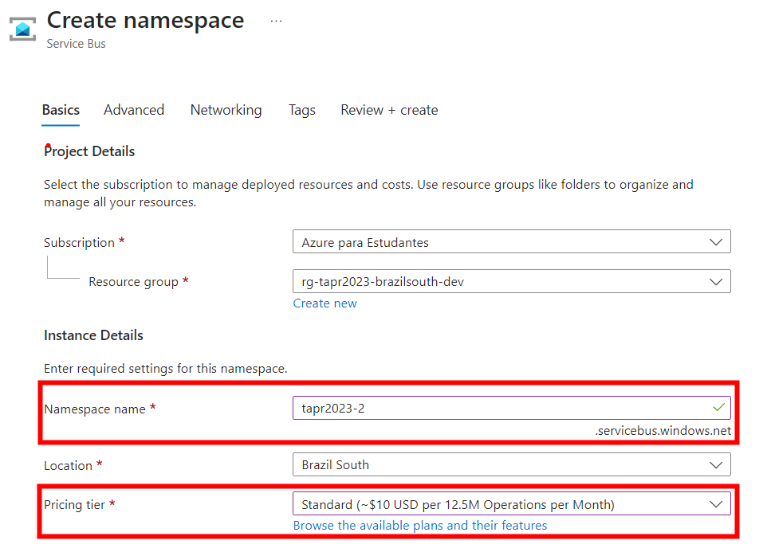
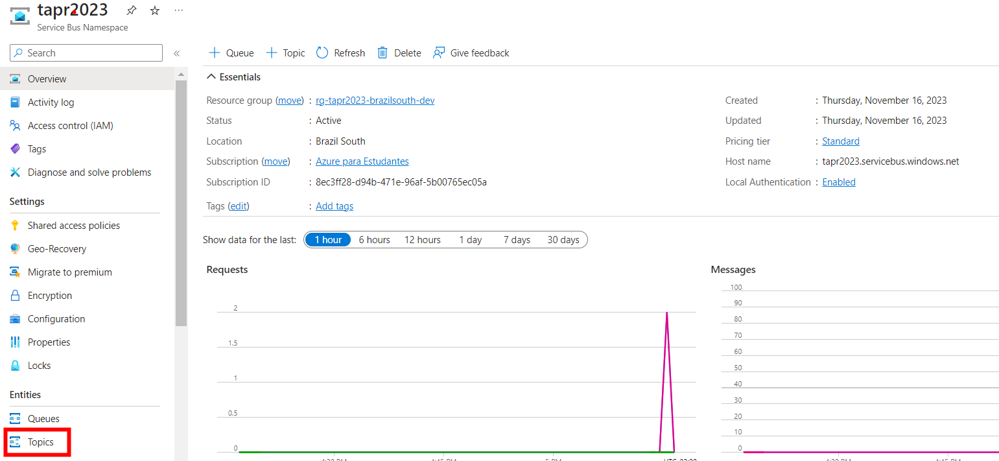
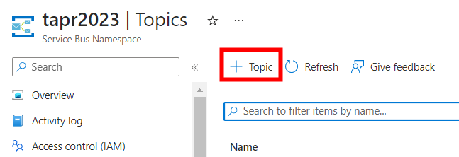
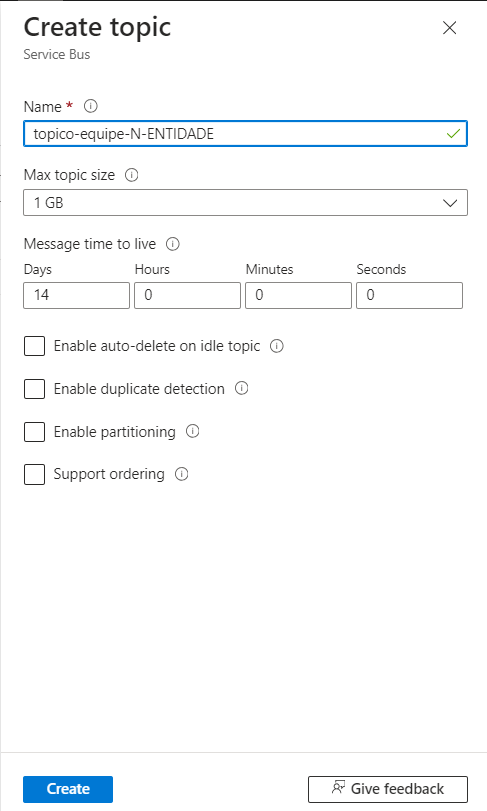
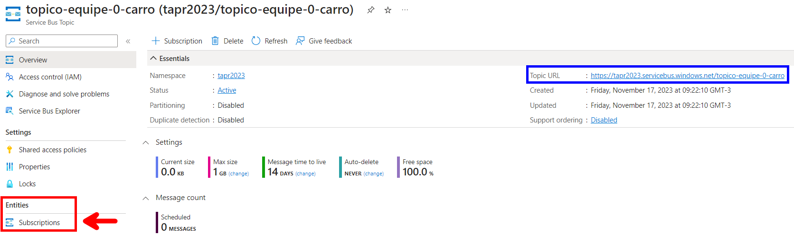
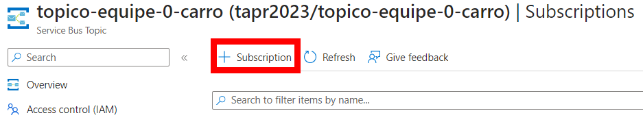
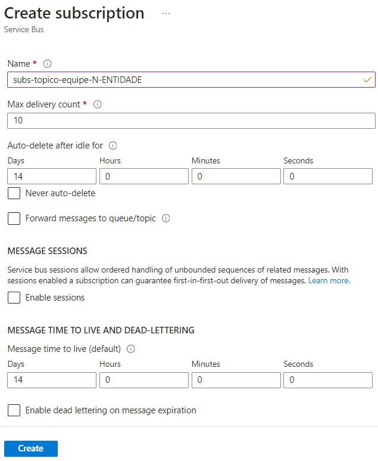
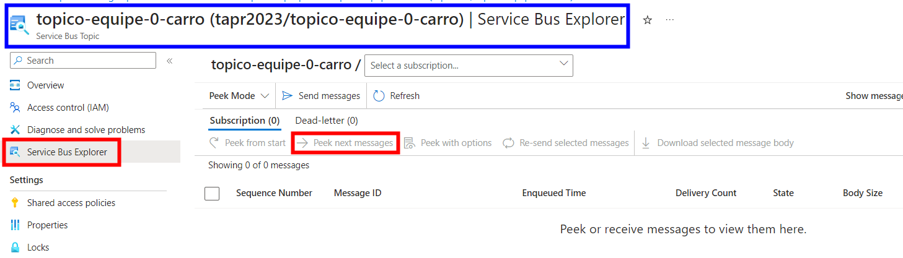

# tapr-2023-equipe1-carro-java


- [Diagrama](diagramas/tapr-microsservico2023.vsdx)

## Autenticação no AZURE
[DOC](https://learn.microsoft.com/en-us/cli/azure/install-azure-cli-linux?pivots=apt)

```
az login -u walter.s@univille.br
az login --use-device-code
az ad signed-in-user show
```

## Extensões do VSCode
[Java Extension Pack](https://marketplace.visualstudio.com/items?itemName=vscjava.vscode-java-pack)
[Springboot Extension Pack](https://marketplace.visualstudio.com/items?itemName=vmware.vscode-boot-dev-pack)
[Rest Client](https://marketplace.visualstudio.com/items?itemName=humao.rest-client)

## Dependências do projeto (pom.xml)
```
        <dependency>
			<groupId>org.springframework.boot</groupId>
			<artifactId>spring-boot-starter-web</artifactId>
		</dependency>

		<dependency>
			<groupId>org.springframework.boot</groupId>
			<artifactId>spring-boot-starter-test</artifactId>
			<scope>test</scope>
		</dependency>

		<dependency>
			<groupId>org.springframework.boot</groupId>
			<artifactId>spring-boot-devtools</artifactId>
			<scope>runtime</scope>
		</dependency>
		<dependency>
			<groupId>com.azure.spring</groupId>
			<artifactId>spring-cloud-azure-starter-data-cosmos</artifactId>
			<version>5.5.0</version>
		</dependency>

		<dependency>
			<groupId>com.azure</groupId>
			<artifactId>azure-spring-data-cosmos</artifactId>
			<version>5.5.0</version>
		</dependency>

		<dependency>
			<groupId>com.azure</groupId>
			<artifactId>azure-identity</artifactId>
			<version>1.10.0</version>
		</dependency>

		<dependency>
			<groupId>org.springdoc</groupId>
			<artifactId>springdoc-openapi-starter-webmvc-ui</artifactId>
			<version>2.1.0</version>
		</dependency>
```

## CosmosDB
- [Introdução](https://learn.microsoft.com/en-us/azure/cosmos-db/introduction)
- [Databases, containers, and items](https://learn.microsoft.com/en-us/azure/cosmos-db/resource-model)

### Configuração RBAC de permissão
```
az cosmosdb sql role assignment create --account-name COSMOSDBACCOUNT --resource-group GRUPODERECURSO --role-assignment-id 00000000-0000-0000-0000-000000000002 --role-definition-name "Cosmos DB Built-in Data Contributor" --scope "/" --principal-id GUIDUSUARIOAD
```

### Falha de conexão com o CosmosDB devido bloqueio na rede da UNIVILLE
- Alunos que utilizarem seus notebooks pessoais conectados a rede UNIVILLE devem alterar o arquivo application.properties para modificar o método de conexão da aplicação com o CosmosDB
- [CosmosDB Gateway Connection](https://learn.microsoft.com/en-us/azure/cosmos-db/dedicated-gateway)
```
spring.cloud.azure.cosmos.connection-mode=gateway
```

### Erro CORS
- [O que é o erro de CORS](https://pt.wikipedia.org/wiki/Cross-origin_resource_sharing#:~:text=Cross-origin%20resource%20sharing%20%E2%80%93%20Wikip%C3%A9dia%2C%20a%20enciclop%C3%A9dia%20livre,pertence%20o%20recurso%20que%20ser%C3%A1%20recuperado.%20%5B%201%5D)

#### Solução
- Criaruma pasta config
- Criar a classe WebConfig.java
```
package br.edu.univille.microservcarro.config;

import org.springframework.context.annotation.Configuration;
import org.springframework.web.servlet.config.annotation.CorsRegistry;
import org.springframework.web.servlet.config.annotation.EnableWebMvc;
import org.springframework.web.servlet.config.annotation.WebMvcConfigurer;

@Configuration
@EnableWebMvc
public class WebConfig implements WebMvcConfigurer  {

    @Override
    public void addCorsMappings(CorsRegistry registry) {
        registry.addMapping("/**");

    }
}
```


## CRUD API REST
### Verbo GET
- Objetivo: Retornar uma lista de objetos ou um objeto específico a partir da chave
#### CarroService.java
- Criar os métodos na interface do serviço
```
public interface CarroService {
    public List<Carro> getAll();
    public Carro getById(String id);
}
```
#### CarroServiceImpl.java
- Implementar a lógica de consulta na classe concreta do serviço
```
@Service
public class CarroServiceImpl implements CarroService{

    @Autowired
    private CarroRepository repository;

    @Override
    public List<Carro> getAll() {
        var iterador = repository.findAll();
        List<Carro> listaCarros = new ArrayList<>();

        iterador.forEach(listaCarros::add);

        return listaCarros;
    }

    @Override
    public Carro getById(String id) {
        var carro = repository.findById(id);
        if(carro.isPresent())
            return carro.get();
        return null;
    }
}
```
#### CarroAPIController.java
- Implememntar no controlador os métodos para buscar do banco todos os carros e para buscar um único carro pelo ID 
```
@RestController
@RequestMapping("/api/v1/carros")
public class CarroAPIController {

    @Autowired
    private CarroService service;

    @GetMapping
    public ResponseEntity<List<Carro>> listaCarros(){
        var listaCarros = service.getAll();
        return 
            new ResponseEntity<List<Carro>>
            (listaCarros, HttpStatus.OK);
    }
    @GetMapping("/{id}")
    public ResponseEntity<Carro> buscarCarro(@PathParam("id") String id){
        var carro = service.getById(id);
        if(carro == null){
            return new ResponseEntity<>(HttpStatus.NOT_FOUND);
        }
        return 
            new ResponseEntity<Carro>
            (carro, HttpStatus.OK);
    }
}
```
#### teste.rest
- Implementação do teste do verbo GET
```
### Buscar todos os carros
GET http://localhost:8080/api/v1/carros

### Buscar carro pelo ID
GET http://localhost:8080/api/v1/carros/580c1134-0409-46e9-99a5-887b8e90636f
```

### Verbo POST
- Objetivo: Inserir uma nova instância da entidade no banco de dados

#### CarroService.java
- Criar o método saveNew na interface de serviço
```
public interface CarroService {
    public List<Carro> getAll();
    public Carro getById(String id);
    public Carro saveNew(Carro carro);
}
```
#### CarroServiceImpl.java
- Implementar a lógica para salvar a nova entidade no banco, o campo ID é alterado para null para garantir que o método será utilizado apenas para incluir novos registros
```
@Override
public Carro saveNew(Carro carro) {
	carro.setId(null);
	return repository.save(carro);
}
```
#### CarroAPIController.java
- Implememntar no controlador o metodo para inserir o novo carro no sistema.
**IMPORTANTE há duas classes RequestBody em pacotes diferentes, utilizar o pacote correto**
```
import org.springframework.web.bind.annotation.RequestBody;
//...
@PostMapping
    public ResponseEntity<Carro> inserirCarro(@RequestBody Carro carro){
        if(carro == null){
            return new ResponseEntity<>(HttpStatus.BAD_REQUEST);
        }
        carro = service.saveNew(carro);
        return 
            new ResponseEntity<Carro>
            (carro, HttpStatus.OK);
    }
```

#### teste.rest
- Implementação do teste do verbo POST
```
### Inserir um novo Carro
POST http://localhost:8080/api/v1/carros
Content-Type: application/json

{
  "placa": "MDB3389"
}
```

### Verbo PUT
- Objetivo: Alterar os dados de uma determinada instância da entidade

#### CarroService.java
- Criar o método update na interface de serviço
```
public interface CarroService {
    public List<Carro> getAll();
    public Carro getById(String id);
    public Carro saveNew(Carro carro);
    public Carro update(String id, Carro carro);
}
```

#### CarroServiceImpl.java
- Implementar a lógica para realizar o update da entidade no banco
```
@Override
public Carro update(String id, Carro carro) {
	var buscaCarroAntigo = repository.findById(id);
	if (buscaCarroAntigo.isPresent()){
		var carroAntigo = buscaCarroAntigo.get();

		//Atualizar cada atributo do objeto antigo 
		carroAntigo.setPlaca(carro.getPlaca());

		return repository.save(carroAntigo);
	}
	return null;
}
```

#### CarroAPIController.java
- Implememntar no controlador o metodo para realizar o update do registro
**IMPORTANTE há duas classes RequestBody em pacotes diferentes, utilizar o pacote correto**
```
@PutMapping("/{id}")
public ResponseEntity<Carro> atualizarCarro(@PathVariable("id")  String id, @RequestBody Carro carro){
	if(carro == null || id == ""  || id == null){
		return new ResponseEntity<>(HttpStatus.BAD_REQUEST);
	}
	carro = service.update(id, carro);
	if(carro == null){
		return new ResponseEntity<>(HttpStatus.NOT_FOUND);
	}
	return 
		new ResponseEntity<Carro>
		(carro, HttpStatus.OK);
}
```

#### teste.rest
- Implementação do teste do verbo PUT

```
### Atualizar o  Carro
PUT http://localhost:8080/api/v1/carros/580c1134-0409-46e9-99a5-887b8e90636f
Content-Type: application/json

{
  "placa": "MAS1334-2"
}
```

### Verbo DELETE
- Objetivo: Remover uma instância da entidade

#### CarroService.java
- Criar o método delete na interface de serviço
```
public interface CarroService {
    public List<Carro> getAll();
    public Carro getById(String id);
    public Carro saveNew(Carro carro);
    public Carro update(String id, Carro carro);
    public Carro delete(String id);
}
```
#### CarroServiceImpl.java
- Implementar a lógica para realizar a exclusão da entidade no banco

```
@Override
    public Carro delete(String id) {
        var buscaCarro = repository.findById(id);
        if (buscaCarro.isPresent()){
            var carro = buscaCarro.get();

            repository.delete(carro);

            return carro;
        }
        return null;
    }
```

#### CarroAPIController.java
- Implememntar no controlador o metodo para realizar a exclusão do registro
```
@DeleteMapping("/{id}")
public ResponseEntity<Carro> removerCarro(@PathVariable("id")  String id){
	if(id == ""  || id == null){
		return new ResponseEntity<>(HttpStatus.BAD_REQUEST);
	}
	var carro = service.delete(id);
	if(carro == null){
		return new ResponseEntity<>(HttpStatus.NOT_FOUND);
	}
	return 
		new ResponseEntity<Carro>
		(carro, HttpStatus.OK);
}
```

#### teste.rest
- Implementação do teste do verbo DELETE
```
### Remover o Carro
DELETE  http://localhost:8080/api/v1/carros/580c1134-0409-46e9-99a5-887b8e90636f
Content-Type: application/json
```

## Chaves de partição
- [DOC: Particionamento](https://learn.microsoft.com/en-us/azure/cosmos-db/partitioning-overview)


## Modelagem de bancos de dados NoSQL
- [DOC: Modelagem de dados](https://learn.microsoft.com/en-us/azure/cosmos-db/nosql/modeling-data)

# Azure Service Bus
- [Documentação](https://azure.microsoft.com/pt-br/products/service-bus)
- Passo 1: Criar uma instância do recurso Service Bus, informando o namespace name e o pricing tier Standard (a partir desse SKU há suporte a tópicos)

- Passo 2: Uma vez provisionado, clicar no menu tópicos

- Passo 3: Clicar no link para criar um novo tópico

- Passo 4: Informar o nome do tópico no padrão topico-equipe-<NUMERODASUAEQUIPE>-<NOMEDAENTIDADE>

- Passo 5: Uma vez que o tópico seja provisionado, clicar em subscriptions

- Passo 6: Clicar no link para criar uma nova subscription

- Passo 7: Informar o nome da assinatura no padrão subs-topico-equipe-<NUMERODASUAEQUIPE>-<NOMEDAENTIDADE>

- Passo 8: Clicar no ícone Service Bus Explorer para monitorar as mensagens



# Dapr
- Dapr é um runtime para construção, integração, execução e monitoramento de aplicações distribuídas no formato de microsserviços

- [Building blocks](https://docs.dapr.io/concepts/overview/#microservice-building-blocks-for-cloud-and-edge)

## Instalação
- [Instalação do Dapr CLI](https://docs.dapr.io/getting-started/install-dapr-cli/)

## Inicialização
```
cd microservcarro
dapr init
```

- Verificando a instalação
```
$ docker ps
CONTAINER ID   IMAGE                COMMAND                  CREATED          STATUS                    PORTS                                                                                                                                     NAMES
f377a492bae6   daprio/dapr:1.12.1   "./placement"            43 seconds ago   Up 42 seconds             0.0.0.0:50005->50005/tcp, :::50005->50005/tcp, 0.0.0.0:58080->8080/tcp, :::58080->8080/tcp, 0.0.0.0:59090->9090/tcp, :::59090->9090/tcp   dapr_placement
a5009c20daa7   redis:6              "docker-entrypoint.s…"   47 seconds ago   Up 44 seconds             0.0.0.0:6379->6379/tcp, :::6379->6379/tcp                                                                                                 dapr_redis
1d669098ac80   openzipkin/zipkin    "start-zipkin"           48 seconds ago   Up 44 seconds (healthy)   9410/tcp, 0.0.0.0:9411->9411/tcp, :::9411->9411/tcp                                                                                       dapr_zipkin
```

## Dependências no POM
- [SDK Java](https://docs.dapr.io/developing-applications/sdks/java/)
```
    <dependency>
      <groupId>io.dapr</groupId>
      <artifactId>dapr-sdk</artifactId>
      <version>1.10.0</version>
    </dependency>
    <!-- Dapr's SDK integration with SpringBoot (optional). -->
    <dependency>
      <groupId>io.dapr</groupId>
      <artifactId>dapr-sdk-springboot</artifactId>
      <version>1.10.0</version>
    </dependency>
```
## Componentes Dapr
- Os componentes do Dapr são recursos utilizados pelos microsserviços que são acessados através do sidecar.
- [Dapr Components](https://docs.dapr.io/reference/components-reference/)
- Passo 1: criar uma pasta dentro de microservcarro -> components
- Passo 2: na pasta components criar o arquivo servicebus-pubsub.yaml

```
# Documentação: https://docs.dapr.io/reference/components-reference/supported-pubsub/setup-azure-servicebus/
apiVersion: dapr.io/v1alpha1
kind: Component
metadata:
  name: servicebus-pubsub
spec:
  type: pubsub.azure.servicebus.topics
  version: v1
  metadata:
  - name: namespaceName
    value: "tapr2023.servicebus.windows.net"
```

- Passo 3.1: na pasta do projeto executar o comando.

```
mvn clean install
```

- Passo 3.2: na pasta principal do projeto (mesma pasta do arquivo pom.xml), criar um novo arquivo com o nome dapr.yaml
```
version: 1
common:
  resourcesPath: ./components/
apps:
  - appID: tapr-2023-equipe1-carro-java
    appDirPath: ./target/
    appPort: 8080
    command: ["java", "-jar", "NOMEDOARQUIVOJARCOMOPROJETO-SNAPSHOT.jar"]

```

## Publicação de atualizações da entidade principal do agregado

- Passo 4: alterar o arquivo application.properties para incluir dois novos parametros:
  - app.component.topic.carro=<nome do tópico registrado no service bus>
  - app.component.service=servicebus-pubsub

```
#Exemplo
app.component.topic.carro=topico-equipe-0-carro
app.component.service=servicebus-pubsub
```

- Passo 5:  na classe de serviço da entidade root do agregado, incluir os seguintes códigos:

```
//outros imports...
import io.dapr.client.DaprClient;
import io.dapr.client.DaprClientBuilder;

@Service
public class CarroServiceImpl implements CarroService{

    //outros atributos...

    private DaprClient client = new DaprClientBuilder().build();
    @Value("${app.component.topic.carro}")
    private String TOPIC_NAME;
    @Value("${app.component.service}")
	private String PUBSUB_NAME;

    //método privado para publicar a atualização
    private void publicarAtualizacao(Carro carro){
        client.publishEvent(
					PUBSUB_NAME,
					TOPIC_NAME,
					carro).block();
    }

    @Override
    public Carro saveNew(Carro carro) {
        carro.setId(null);
        carro = repository.save(carro);
        publicarAtualizacao(carro);
        return carro;
    }

    @Override
    public Carro update(String id, Carro carro) {
        var buscaCarroAntigo = repository.findById(id);
        if (buscaCarroAntigo.isPresent()){
            var carroAntigo = buscaCarroAntigo.get();

            //Atualizar cada atributo do objeto antigo 
            carroAntigo.setPlaca(carro.getPlaca());
            carroAntigo = repository.save(carroAntigo);
            publicarAtualizacao(carroAntigo);
            return carroAntigo;
        }
        return null;
    }
```

## Executar o teste de publicação de eventos
```
#Executar esse comando dentro da pasta do projeto
mvn clean install
dapr run -f .
```
- Passo 6: Usar o arquivo teste.rest para invocar a API REST nos métodos POST e PUT, verificar no Azure Service Bus se os eventos foram publicados no tópico.

## Assinatura das atualizações em um tópico
- Escolher uma das entidades externas aos agregados.

- Passo 1: alterar o arquivo application.properties para incluir um novo parametro com o nome do tópico registrado no Service Bus que se deseja receber os eventos

```
app.component.topic.cliente=<nome do tópico registrado no service bus>
```

- Passo 2: Criar na classe Controller da entidade externa ao agregado um novo end point chamado atualizar, que será automaticamente chamado pelo Dapr toda vez que um novo evento for publicado no Service Bus

```
    @Topic(name = "${app.component.topic.cliente}", pubsubName = "${app.component.service}")
    @PostMapping(path = "/event", consumes = MediaType.ALL_VALUE)
    public ResponseEntity<Cliente> atualizarCliente(@RequestBody(required = false) CloudEvent<Cliente> cloudEvent){
        var cliente = service.update(cloudEvent.getData());
        return 
            new ResponseEntity<Cliente>
            (cliente, HttpStatus.OK);
    }
```
- Passo 3: alterar a classe de serviço da entidade, para incluir um método update recebendo como parâmetro apenas a classe de entidade.

```
public interface ClienteService {
    public List<Cliente> getAll();
    public Cliente getById(String id);
    public Cliente saveNew(Cliente cliente);
    public Cliente update(String id, Cliente cliente);
    public Cliente update(Cliente cliente);
}
```
- Passo 4: incluir na classe de implementação do serviço da entidade, o código do método abaixo para receber a entidade e atualizar no banco de dados local do serviço.

```
@Override
public Cliente update(Cliente cliente) {
    return repository.save(cliente);
}
```
## Executar o teste de assinatura dos eventos
```
#Executar esse comando dentro da pasta do projeto
mvn clean install
dapr run -f .
```
- Mantendo a aplicação em execução, abrir um novo terminal e executar o exemplo do comando abaixo alterando os parametros para simular a publicação de um evento.

```
#Exemplo de publicação de atualização do evento
# dapr publish --publish-app-id <nome da aplicação no arquivo dapr.yaml> --pubsub <nome do componente do service bus no arquivo /componenets/servicebus-pubsub.yaml> --topic <nome do topico registrado no service bus> --data '<objeto JSON contendo os campos da entidade>'

dapr publish --publish-app-id tapr-2023-equipe1-carro-java --pubsub servicebus-pubsub --topic topico-equipe-0-cliente --data '{"id": "123","nome": "Zezinho","endereco": "Rua lalala 100"}'
```

- Verificar no banco de dados se a entidade foi registrada.